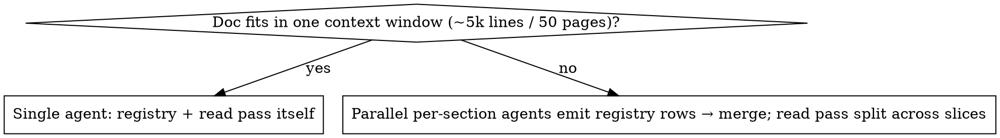

# Trains-of-thought audit

## Overview

Long multi-section documents — especially LLM-written or many-times-edited ones — drift. A concept is defined one way in §1 and used differently in §9; a number stated early disagrees with the same number later. The root cause: **the document's core specifications are never written down and tracked**, so each section re-derives them from fading memory and lands somewhere slightly different.

**No single reading pass catches everything** (this was measured — see Evidence). The audit therefore runs **two complementary passes into one verification gate**:

1. **A structured registry pass** — extract a typed registry of *every* claim, then reconcile it. Complete and systematic on quantities, numbering, and definitions; catches drift that is pages apart.
2. **A directed read pass** — a linear read holding cross-section context, hunting the contradiction classes a registry under-registers (repudiated claims that resurface, broken internal arithmetic).
3. **An adversarial verification gate** — every candidate from either pass is re-checked against the document by re-quoting both sides; anything that can't be re-quoted is discarded.

The registry gives completeness and trustworthy precision; the read pass gives recall on the unanticipated; the gate makes both safe to ship. Run all three and union the confirmed findings. (The old framing "structure surfaces the problem; prose doesn't" is wrong — a plain read caught the single worst error a numbers-only registry missed.)

## When to use

The trigger is multi-pivot / LLM-drift damage, **not** size. Size decides only *how you dispatch the registry pass*:



**Symptoms that trigger this audit:**
- The document has been through 2+ architecture pivots, or is long-form LLM output
- The same quantity is given different values in different sections
- A bullet list enumerates items the adjacent table treats differently (count drift)
- A concept's definition/framing shifts between sections (meandering trains of thought)
- An "Invention #N" / component number is declared dead in one place, cited as live in another
- Cross-references ("§4.2", "Invention #N") point at a section/name that no longer exists
- A forward-voice / prose cleanup pass already ran but missed cross-section contradictions

**Don't use for:** fresh documents; pure spec / API-reference with no reasoning to track; a short doc one careful read covers (a small but heavily-pivoted doc still earns the audit — use one agent).

## Step 0 — the canonical authority (do this first)

The registry's "canonical" value *cannot come from the document alone*: the document is the thing that's inconsistent. Fix the tie-breaker up front: (a) ask the user for the current truth; (b) take it from the newest / most-recently-edited section, an ADR / changelog / decision log; (c) if nothing is authoritative, the concept's canonical slot stays **UNRESOLVED** and that conflict is itself the finding. **Never silently pick one value and flag the rest as drift** — a wrong guess blesses the error and flags the correct mentions. Non-negotiable.

## Pass 1 — the typed registry

**Extract exhaustively BY TYPE; filter for conflict at reconcile, not at extraction.** The failure mode that wrecks recall is pre-judging which claims are "important enough" to register — the claims that drift are usually the ones that look minor. Register every claim that fits a type; reconciliation (cheap) decides what conflicts.

Per section (one agent per file, or per heading-range for a monolithic file — hand each the shared **section index**), emit a row per claim:

```
- type: quantity | definition_scope | repudiation | identity_numbering |
        benchmark_analogy | derived_arithmetic | justification_count
- subject: <the entity/concept the claim is about — for grouping>
- statement: <the claim, normalized>
- value: <number+unit, if any>
- sectionRef + quote: <verbatim, so another agent can re-locate it>
```

The type list is the recall contract — each type is a class the audit must reconcile:
- **repudiation** — anything the text rejects / calls non-credible / "we do NOT do X". (A repudiated claim used elsewhere is a self-contradiction.)
- **identity_numbering** — invention/component/product numbers and names, and any marked folded/dead/superseded.
- **derived_arithmetic** — any stated sum/total/breakdown, so the math can be re-checked.
- **justification_count** — counts/rates/multiples used to *justify a conclusion* (saves/year, conversion %, units needed).

## Pass 2 — the directed read (recall safety net)

A linear read (split across slices for a big doc) that holds cross-section context and hunts contradictions the registry under-registers — **especially** a benchmark/approach repudiated in one place but used in another, an internal sum whose parts don't add up, and a justification count that differs from the same count elsewhere. Quote both sides. This pass exists because a registry only diffs what it registered; a read notices the unanticipated. Its candidates go through the same gate.

## Reconcile — the typed checks

Run **all** of these over the merged registry + read-pass candidates, not just value grouping:

- **value_group** — group `quantity`/`justification_count` by `(subject, attribute)`, normalizing aliases; >1 distinct value = candidate.
- **repudiation_vs_use** — for every `repudiation`, search whether the rejected thing is asserted/used elsewhere.
- **numbering_identity** — any item marked folded/dead/superseded that is also cited as live; the same number used for two things; a "list of N" that enumerates ≠ N.
- **internal_arithmetic** — for every stated total with a breakdown, **recompute literally**. If the parts don't sum to the total, it is a candidate **even if the text hedges** ("windowed", "approximate") — escalate the hedge to the author; do not accept hand-waving as reconciliation.
- **justification_count** — counts justifying the *same conclusion* that disagree. Normalize **functional** aliases, not just name aliases: "saves that justify the capex" and "saves needed to break even" are the same quantity under two labels — key them together before comparing.
- **framing** — the same concept defined/framed against its canonical definition (the meander). Judgment, not grep.

## The verification gate (this is where precision is made)

Every candidate is handed to a fresh agent that **re-reads both cited locations in the document** and confirms a genuine *same-thing-same-sense* contradiction. Reject if: the quote isn't found (hallucination), the two figures are different things sharing a name, or both are legitimately true in context (conservative vs aggressive scenario, gross vs net, different region/year). Confirm only if airtight, with verbatim quotes. This gate is what makes the audit shippable without re-checking — in testing it held false positives at zero.

## Drift report (the output)

Per concept, a card — canonical entry (or `UNRESOLVED: <competing options>`), every deviation with both quotes and a one-line fix, and a drift measure (distinct values/framings × section span × resolved?). Order by severity (UNRESOLVED canonical > confirmed value drift > numbering/repudiation > framing > stale ref). Then ask the user which to remediate. **Read-only throughout** — the audit never edits; the user decides the fixes.

## Coverage limits (read before trusting a clean result)

- **A clean report is not a clean document.** This finds drift between *registered/hunted* claims. It does not verify claims are *true*, and cannot catch drift in a class neither pass surfaced. Never read "no findings" as "consistent."
- **Internal arithmetic and cross-label justification counts are the known-weak spots** (measured — see Evidence). The literal-recompute and functional-alias rules above mitigate but do not eliminate them; the directed read is the backstop, and it too can miss a hedged sum. Re-check these two classes by hand on a high-stakes doc.
- **The registry can encode a wrong canonical.** If Step 0's authority is wrong, every correct mention is flagged. `UNRESOLVED` beats a confident wrong canonical.
- **An LLM building the registry has the same memory limit that caused the drift** — so on a large doc the registry must be built by per-section extraction, never one pass over the whole.

## Evidence

Measured on a real 75k-word, 22-section technical + investment report (not a synthetic fixture — synthetic tests where the same model plants and "finds" a defect prove nothing).

- A **numbers-first single registry pass** found **12 verbatim-confirmed drifts at 0% false positives** — including an investor-facing seed-ask stated as €1.5–2M in the front matter while the body set it at €5–10M and thrice called the front-matter figure "non-credible." But a parallel naive read caught **5 genuine contradictions it missed**, including a ~4× error in the core unit-economics and an "Invention #N" numbering break — the skill's own headline pattern.
- After the fix above (typed exhaustive extraction + directed read + typed checks), the method **caught 3 of those 5** (the repudiated benchmark, the invention-numbering, a spec figure) **and surfaced ~5 additional real numbering/identity contradictions the first pass missed entirely** — still at **0 false positives**.
- **2 of 5 remained uncaught — both internal-arithmetic** (a hedged label-vs-breakdown sum, and a cross-label justification-count mismatch). Hence the two-pass design and the hand-recheck caveat: treat this as a high-precision recall *aid*, run it alongside a careful read, and union the results.
